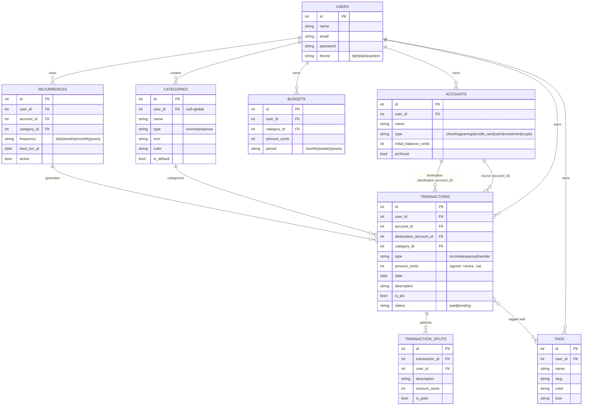

# ☀️ Solar

> Your personal finances, with their own light.

**Solar** is a modernized clone of **Microsoft Money Sunset (2008)**, built on **Laravel 13 + Vue 3 + Inertia 3** with a contemporary Brazilian fintech UX (Nubank / Inter / Will as references).

## ✨ Status atual — FASE 3 entregue

As fases **1**, **2** e **3** estão completas e mergeadas. Detalhes abaixo.

### FASE 1 — Foundation ✅
- 🔐 **Auth completo** — registro, login, logout, middleware
- 🏠 **Dashboard** com 4 cards KPI (saldo total, receitas/despesas/economia do mês), lista de contas e transações recentes
- 💳 **CRUD de Contas** (corrente, poupança, cartão, dinheiro, investimento, cripto) com saldo calculado em tempo real
- 💸 **CRUD de Transações** (receitas, despesas, transferências) com filtros (busca, conta, categoria, tipo), paginação, flag PIX
- 🏷️ **15 Categorias** pré-populadas (Alimentação, Transporte, Moradia, Saúde, Educação, etc) com ícones emoji e cores
- 🌗 **Dark mode** com persistência em `localStorage` + tabela `users.theme`
- ⌨️ **Atalhos de teclado** (`n` = nova transação, `g d` = dashboard, `g t` = transações, etc)
- 📱 **Mobile-first** com bottom bar de navegação e FAB para nova transação

### FASE 2 — Orçamentos + Recorrências + Relatórios ✅
- 🔄 **Recorrências** — geram transações futuras automaticamente (semanal, mensal, anual, personalizado)
- 💰 **Orçamentos** por categoria, com barra de progresso e alerta visual ao atingir 80% / 100%
- 📊 **Relatórios** com gráficos reais (ApexCharts): pizza por categoria, linha de fluxo 12 meses, despesas diárias, top merchants
- 🧪 `ReportService` centraliza cálculos e cacheia por 5 min por usuário

### FASE 3 — Tags + Splits + Busca global + Filtros avançados ✅
- 🏷️ **Tags** coloridas e com emoji para organizar transações (8 tags demo: Trabalho, Pessoal, Urgente, Família, Viagem, Casa, Investimento, Imposto)
- ✂️ **Splits de transação** — dividir uma despesa igualmente, por percentual, ou por valor exato (ótimo pra roommates, casais, viagem)
- 🔍 **Busca global** (pressione `/`) em transações, contas, tags
- 🎯 **Filtros avançados** na lista de transações: período (este mês, últimos 3, personalizado), tipo, status (pago/pendente), conta, categoria, valor mín/máx
- 🔒 API JSON `/api/tags` e `/api/search` com auth de sessão (não token)

> ⚠️ **Bug conhecido:** o gráfico de "Fluxo de caixa" no dashboard exibe placeholder quando deveria renderizar ApexCharts (issue #5 — gráficos do `Dashboard.vue` ficaram de fora do último merge). A FASE 2 entregou os gráficos só na página `/reports`. Workaround: visite `/reports` para ver os gráficos.

## 🚀 Quick start

```bash
git clone https://github.com/hdellamanna/solar.git
cd solar

# Backend deps
composer install

# Frontend deps
npm install

# Banco SQLite + dados demo
touch database/database.sqlite
php artisan migrate:fresh --seed

# Subir
php artisan serve --host 0.0.0.0 --port 8000
./node_modules/.bin/vite --host 0.0.0.0 --port 5173 --strictPort   # em outro terminal
```

Acesse `http://localhost:8000` e entre com:

- **Email:** `demo@solar.app`
- **Senha:** `solar123`

## 🧪 Testes

```bash
php artisan test
```

Resultado atual:
```
Tests:  69 passed (272 assertions)
Duration: 1.71s
```

Cobertura:
- Auth (registro, login, logout, middleware)
- Contas (CRUD, saldo, isolamento, soft delete)
- Transações (income, expense, transfer, soft delete, splits, filtros)
- Recorrências (geração automática, soft delete, inativa não gera)
- Orçamentos (cálculo, reset, isolamento por user)
- Relatórios (12 meses, top categorias, top merchants, isolamento)
- Tags (CRUD, slug auto, attach/detach, validação, isolamento)
- Busca global (descrição, notas, valor, isolamento)

## 🏗️ Stack

| Camada       | Tecnologia                              |
|--------------|------------------------------------------|
| Backend      | Laravel 13.13 · PHP 8.4 · SQLite (dev)   |
| Auth         | Sessions + CSRF (built-in, sem Breeze)   |
| Bridge       | Inertia.js 3.3 (sem API separada)        |
| Frontend     | Vue 3.5 · Composition API                |
| Estado       | Pinia 3                                  |
| UI           | Tailwind 3.4 + tokens custom (solar)    |
| Bundler      | Vite 8 (rolldown)                        |
| Charts       | ApexCharts 5.13 + vue3-apexcharts        |
| Validação    | FormRequest (backend) + useForm (frontend) |
| Testes       | PHPUnit 11 (Pest ainda sem suporte Laravel 13) |

## 🗂️ Estrutura

```
app/
  Models/         # User, Account, Category, Transaction, Recurrence, Budget, Tag, TransactionSplit
  Services/       # ReportService (monthlyFlow, categoryBreakdown, kpis, ...)
  Http/
    Controllers/  # Account*, Auth/*, Budget*, Dashboard*, Profile*, Recurrence*, Report*, Tag*, Transaction*
    Requests/     # FormRequests por recurso (Store/Update)
    Middleware/   # HandleInertiaRequests (compartilha auth.user)
database/
  migrations/     # 16 migrations, soft deletes + índices
  seeders/        # 1 user demo, 5 contas, 15 categorias, ~170 transações, 8 tags
resources/js/
  Pages/
    Auth/         # Login, Register
    Accounts/     # Index, Create, Edit
    Transactions/ # Index, Form, Show
    Tags/         # Index (grid de cards)
    Budgets/      # Index
    Recurrences/  # Index, Create, Edit
    Reports/      # Index (ApexCharts: line, donut, bar, horizontal)
    Placeholders/ # Futuras seções
    Profile/      # Edit
  Layouts/        # AuthenticatedLayout (sidebar + bottombar), GuestLayout
  Composables/    # useFormat, useShortcuts, useChart (useLineConfig/useDonutConfig/useBarConfig), useTag, useTransactionFilters
  app.js          # createInertiaApp + Pinia + Ziggy + ApexCharts global
```

## 💰 Modelo de dados — diagrama ER



**Convenção monetária:** todos os valores são armazenados como `int` em centavos. Conversão para reais (divisão por 100) só acontece na camada de apresentação.

**Convenção de sinal:**
- `income` → `amount_cents > 0` (entra)
- `expense` → `amount_cents < 0` (sai)
- `transfer` → `amount_cents < 0` (sai da origem; destino recebe via `destinationTransactions`)

## 📐 UI/UX

- **Mobile-first**: testado em 375px (iPhone SE) até 1920px
- **Cores semânticas**: verde `income` (#16a34a), vermelho `expense` (#dc2626), amarelo `warn` (#ca8a04), azul `info` (#2563eb)
- **Moeda formatada** sempre em pt-BR: `R$ 1.234,56` via `Intl.NumberFormat`
- **Datas** em formato brasileiro: `26/06/2026`
- **Dark mode** com classe `dark` no `<html>`, persistido em `localStorage` e tabela `users.theme`
- **Bottom bar mobile** com 5 ícones + FAB central para nova transação
- **Atalhos de teclado**: `n` (nova tx), `g d` (dashboard), `g t` (transações), `g a` (contas), `/` (busca global), `Esc` (fechar modais)

## 🛣️ Roadmap

| Fase | Status | Entrega |
|------|--------|---------|
| **FASE 1** | ✅ mergeada (#1) | Auth + Dashboard + CRUD contas/transações + seeders + 13 testes |
| **FASE 2** | ✅ mergeada (#2) | Recorrências + Orçamentos + Relatórios ApexCharts |
| **FASE 3** | ✅ mergeada (#3) | Tags + Splits + Busca global + Filtros avançados |
| **FASE 3.1** | ✅ mergeada (#4) | Fix: API JSON usa sessão web, remove R$ duplicado |
| **Issue #5** | 🐞 known bug | Gráfico "Fluxo de caixa" no dashboard mostra placeholder (workaround: /reports) |
| FASE 4 | ⏸️ pausada | Importação CSV/OFX + Metas de economia + Multi-moeda (branches experimentais, ver `feat/fase-4*`) |
| FASE 5 | ⏸️ futura | Investimentos + Dívidas + IA categorize + PWA |
| FASE 6 | ⏸️ futura | Open Finance (Belvo mock) + OCR de cupons + Modo casal |

## 🤝 Contribuindo

PRs são bem-vindos. Antes de abrir:

```bash
composer install
npm install
php artisan test
```

Padrões do projeto:
- PHP em inglês (nomes, comentários), UI em pt-BR
- PHPDoc em todo método público de service/controller
- Soft deletes em qualquer tabela com dados de usuário
- Conventional commits (`feat:`, `fix:`, `chore:`, `docs:`)
- Branches: `feat/fase-N-funcionalidade`, PR contra `main`
- Não mergeie o próprio PR — espere review

## 📄 Licença

MIT — veja [LICENSE](LICENSE).
