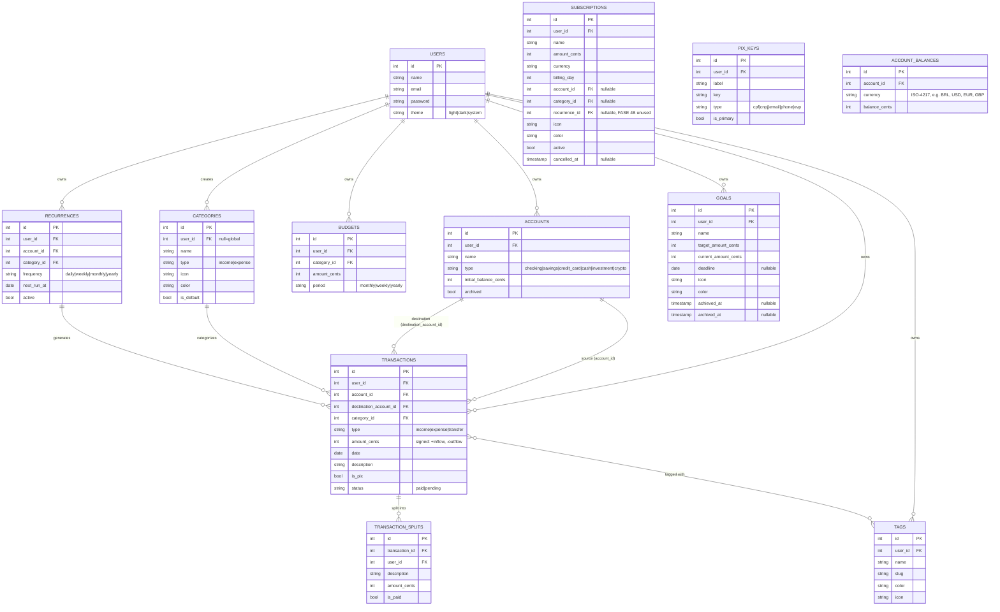

# ☀️ Solar

> Your personal finances, with their own light.

**Solar** is a modernized clone of **Microsoft Money Sunset (2008)**, built on **Laravel 13 + Vue 3 + Inertia 3** with a contemporary Brazilian fintech UX (Nubank / Inter / Will as references).

## ✨ Current status — FASE 6A delivered

Phases **1**, **2**, **3**, **4A / 4B / 4C** and **6A** are complete and merged. Phases 5, 6B, 7, 8, 9, 10 are pending.

### FASE 1 — Foundation ✅
- 🔐 **Full auth** — registration, login, logout, middleware
- 🏠 **Dashboard** with 4 KPI cards (total balance, monthly inflow / outflow / savings), accounts list, recent transactions
- 💳 **Accounts CRUD** (checking, savings, credit card, cash, investment, crypto) with real-time computed balance
- 💸 **Transactions CRUD** (income, expense, transfer) with filters (search, account, category, type), pagination, PIX flag
- 🏷️ **15 pre-populated Categories** (Alimentação, Transporte, Moradia, Saúde, Educação, etc) with emoji icons and colors
- 🌗 **Dark mode** persisted in `localStorage` + `users.theme` table
- ⌨️ **Keyboard shortcuts** (`n` = new transaction, `g d` = dashboard, `g t` = transactions, etc)
- 📱 **Mobile-first** with bottom bar navigation and FAB for new transaction

### FASE 2 — Budgets + Recurrences + Reports ✅
- 🔄 **Recurrences** — auto-generate future transactions (weekly, monthly, yearly, custom)
- 💰 **Budgets** per category with progress bar and visual alert at 80% / 100%
- 📊 **Reports** with real charts (ApexCharts): category donut, 12-month flow line, daily spending, top merchants
- 🧪 `ReportService` centralizes calculations and caches for 5 min per user

### FASE 3 — Tags + Splits + Global search + Advanced filters ✅
- 🏷️ **Tags** colored and with emoji to organize transactions (8 demo tags: Trabalho, Pessoal, Urgente, Família, Viagem, Casa, Investimento, Imposto)
- ✂️ **Transaction splits** — divide an expense equally, by percentage, or by exact amount (great for roommates, couples, trips)
- 🔍 **Global search** (press `/`) across transactions, accounts, tags
- 🎯 **Advanced filters** on the transactions list: period (this month, last 3, custom), type, status (paid / pending), account, category, min / max amount
- 🔒 JSON API `/api/tags` and `/api/search` with session auth (not token)

### FASE 4A — Savings goals ✅
- 🎯 **Goals CRUD** with target amount, optional deadline, emoji icon, color
- 💸 **Contribute / withdraw** actions (in cents) keep a running `current_amount_cents`
- 🏆 **Auto-stamp** of `achieved_at` when current ≥ target
- 🛟 **Soft archive** keeps history without deleting
- 📊 **Dashboard widget** surfaces the top 3 in-progress goals (closest deadline first)
- 🧮 14 feature tests covering CRUD, contribute / withdraw, validation, isolation, achieved stamping, and progress cap at 100%

### FASE 4B — Tracked subscriptions ✅
- 📺 **Subscriptions CRUD** (Netflix, Spotify, iCloud, etc) with `billing_day`, amount, account, category, icon, color
- ⏸️ **Pause / reactivate** — paused subs are kept visible but excluded from monthly totals; cancelled subs are soft-archived
- 📅 **Auto-derived `next_billing_at`** from `billing_day` (rolls to next month when the day has already passed)
- 📊 **Dashboard widget** with monthly total + 3 closest to next billing
- 💸 Monthly and yearly projections per subscription
- 🧪 13 feature tests covering CRUD, pause / reactivate, billing-day roll-over, validation, isolation, dashboard widget

### FASE 4C — Dedicated PIX UI ✅
- 💸 **`/pix` screen** with monthly totals (received, sent, count), recent PIX transactions, saved keys, and most-used keys
- 🔑 **Saved PIX keys** (`pix_keys` table) with label, type (cpf / cnpj / email / phone / evp), primary flag
- 🧾 **Mock BR Code generator** — bottom-sheet on mobile, modal on desktop, builds a copy-pasteable string in the simplified EMV format (not scannable — the point is the UX, not real settlement)
- 🪪 **Key type auto-detection** (`usePix` composable: `classifyPixKey`, `maskPixKey`, `pixKeyTypeInfo`)
- 🎨 Apple-style bottom sheet with slide-up transition, auto-validating key, "Copiar" with `navigator.clipboard` + fallback
- 🧪 6 feature tests covering isolation, top-keys grouping, saved-keys, month totals

### FASE 6A — Multi-currency (Wise / Nomad / C6 Global / Inter Global) ✅
- 🌐 **Sub-balances per currency on a single account** — `account_balances` table with `unique(account_id, currency)`, so one account can hold BRL **and** USD (and EUR, GBP) at the same time. This is the actual behaviour of Wise, Nomad Global, C6 Global and Inter Global.
- 💱 **Per-transaction FX snapshot** — `transactions.currency` and `transactions.exchange_rate_cents` capture the rate at creation time, so historical reports stay correct even when the live rate moves.
- 🏠 **User home currency** — `users.home_currency` (default BRL) is the reporting currency. Every dashboard aggregate (total balance, month inflow / outflow) is converted to it via cached FX rates.
- 📡 **FxRateService** — backed by [frankfurter.app](https://frankfurter.app) (free ECB reference rates, no API key). 12-hour cache per `(base, quote, date)` tuple. Returns `1.0` for same currency, `null` on upstream failure (callers gracefully fall back to native-currency amounts).
- 🆕 **New account type** — `multi_currency` joined the existing `checking / savings / credit_card / cash / investment / crypto` set. The Create / Edit forms swap the layout when this type is selected: a primary-currency field plus a one-click sub-balances editor (`+ Adicionar moeda`).
- 🎨 Apple-style sub-balances card on the Accounts index — home balance in big numbers, a thin divider, then the sub-balances listed under it in tabular-nums.
- 🌱 **Demo seed** — the demo user now starts with 6 accounts including a `Wise (Multi-moeda)` holding BRL 50.00 (home) + USD 850.00 + EUR 320.00, so the FASE 6A UI is visible immediately after `migrate:fresh --seed`.
- 🧪 15 new feature tests — `AccountBalanceTest` (6) and `FxRateServiceTest` (9) with `Http::fake()` covering the rate, cache, date snapshots, refresh, and graceful failures.

## 🚀 Quick start

```bash
git clone https://github.com/hdellamanna/solar.git
cd solar

# Backend deps
composer install

# Frontend deps
npm install

# SQLite database + demo data
touch database/database.sqlite
php artisan migrate:fresh --seed

# Run
php artisan serve --host 0.0.0.0 --port 8000
npm run dev   # in another terminal
```

Open `http://localhost:8000` and sign in with:

- **Email:** `demo@solar.app`
- **Password:** `solar123`

## 🧪 Tests

```bash
php artisan test
```

Current result:

```
Tests:  120 passed (532 assertions)
Duration: 1.47s
```

Coverage by feature:

- **Auth** — registration, login, logout, middleware
- **Accounts** — CRUD, balance, isolation, soft delete
- **Transactions** — income, expense, transfer, soft delete, splits, filters
- **Recurrences** — auto-generation, soft delete, inactive does not generate
- **Budgets** — calculation, reset, isolation by user
- **Reports** — 12 months, top categories, top merchants, isolation
- **Tags** — CRUD, auto slug, attach / detach, validation, isolation
- **Search** — global search by description, notes, amount, isolation
- **API auth** — `/api/*` uses session auth, not tokens
- **Goals (FASE 4A)** — CRUD, contribute / withdraw, achieved stamping, progress cap, isolation
- **Subscriptions (FASE 4B)** — CRUD, pause / reactivate, billing-day roll-over, validation, isolation, dashboard widget
- **PIX (FASE 4C)** — isolation, top-keys grouping, saved-keys, month totals
- **Multi-currency (FASE 6A)** — sub-balances CRUD, isolation, FxRateService cache + dates + failure modes

## 🏗️ Stack

| Layer        | Technology                                |
|--------------|-------------------------------------------|
| Backend      | Laravel 13.13 · PHP 8.4 · SQLite (dev)    |
| Auth         | Sessions + CSRF (built-in, no Breeze)     |
| Bridge       | Inertia.js 3.3 (no separate API)          |
| Frontend     | Vue 3.5 · Composition API                 |
| State        | Pinia 3                                   |
| UI           | Tailwind 3.4 + custom solar tokens        |
| Bundler      | Vite 8 (rolldown)                         |
| Charts       | ApexCharts 5.13 + vue3-apexcharts         |
| Validation   | FormRequest (backend) + useForm (frontend)|
| Tests        | PHPUnit 12 (Pest not yet supported on Laravel 13) |

## 🗂️ Structure

```
app/
  Models/         # User, Account, Category, Transaction, Recurrence, Budget, Tag, TransactionSplit, Goal, Subscription, PixKey, AccountBalance (FASE 6A)
  Services/       # ReportService (monthlyFlow, categoryBreakdown, kpis, ...), RecurrenceService, TransactionFilterService, TransactionSplitService, FxRateService (FASE 6A, frankfurter.app)
  Http/
    Controllers/  # Account*, Auth/*, Budget*, Dashboard*, Goal*, Profile*, Recurrence*, Report*, Tag*, Transaction*
    Requests/     # FormRequests per resource (Store / Update)
    Middleware/   # HandleInertiaRequests (shares auth.user)
database/
  migrations/     # 22 migrations, soft deletes + indexes (FASE 6A adds account_balances, users.home_currency, transactions.currency + exchange_rate)
  seeders/        # 1 demo user, 6 accounts (incl. Wise multi-currency), 15 categories, ~155 transactions, 8 tags, 3 goals, 4 subscriptions, 3 saved PIX keys, 2 sub-balances
resources/js/
  Pages/
    Auth/         # Login, Register
    Accounts/     # Index, Create, Edit (Create / Edit render the sub-balances editor when type=multi_currency)
    Transactions/ # Index, Form, Show
    Tags/         # Index (cards grid)
    Budgets/      # Index
    Recurrences/  # Index, Create, Edit
    Goals/        # Index, Create, Edit (FASE 4A)
    Subscriptions/# Index, Create, Edit (FASE 4B)
    Pix/          # Index (FASE 4C) — dedicated PIX UI with BR Code generator
    Reports/      # Index (ApexCharts: line, donut, bar, horizontal)
    Profile/      # Edit
  Layouts/        # AuthenticatedLayout (sidebar + bottom bar), GuestLayout
  Composables/    # useFormat, useShortcuts, useChart (useLineConfig / useDonutConfig / useBarConfig), useTag, useTransactionFilters, useGlobalSearch, usePix (FASE 4C)
  app.js          # createInertiaApp + Pinia + Ziggy + ApexCharts global
```

## 💰 Data model — ER diagram



**Money convention:** all amounts are stored as `int` cents. Conversion to BRL (division by 100) only happens in the presentation layer.

**Sign convention:**

- `income` → `amount_cents > 0` (inflow)
- `expense` → `amount_cents < 0` (outflow)
- `transfer` → `amount_cents < 0` (outflow from source; destination receives via `destinationTransactions`)

## 📐 UI/UX

- **Mobile-first** — tested from 375px (iPhone SE) up to 1920px
- **Semantic colors** — green `income` (#16a34a), red `expense` (#dc2626), yellow `warn` (#ca8a04), blue `info` (#2563eb)
- **Currency** formatted in pt-BR: `R$ 1.234,56` via `Intl.NumberFormat`
- **Dates** in Brazilian format: `26/06/2026`
- **Dark mode** with `dark` class on `<html>`, persisted in `localStorage` and `users.theme`
- **Mobile bottom bar** with 5 icons + central FAB for new transaction
- **Keyboard shortcuts** — `n` (new tx), `g d` (dashboard), `g t` (transactions), `g a` (accounts), `/` (global search), `Esc` (close modals)

## 🛣️ Roadmap

| Phase | Status  | Deliverable                                                                              |
|-------|---------|------------------------------------------------------------------------------------------|
| 1     | ✅ done | Auth + Dashboard + Accounts / Transactions CRUD + seeders + tests                       |
| 2     | ✅ done | Recurrences + Budgets + Reports (ApexCharts)                                            |
| 3     | ✅ done | Tags + Splits + Global search + Advanced filters                                        |
| 4A    | ✅ done | Savings goals with dashboard widget                                                     |
| 4B    | ✅ done | Tracked subscriptions with dashboard widget (Apple-style UI)                             |
| 4C    | ✅ done | Dedicated PIX UI with saved keys and mock BR Code generator                              |
| 5     | ⏳ todo | [Investments](#fase-5--investments--dívidas--ia-categorize--pwa)                         |
| 6A    | ✅ done | Multi-currency accounts (Wise / Nomad / C6 Global / Inter Global) with FX snapshot         |
| 6B    | ⏳ todo | Couples mode + OFX / CSV import + OCR                                                     |
| 7     | ⏳ todo | [Tri-lingual i18n](#fase-7--i18n-tri-língue)                                              |
| 8     | ⏳ todo | [AI financial advisor](#fase-8--ai-insights)                                              |
| 9     | ⏳ todo | [Crypto tracker](#fase-9--crypto)                                                         |
| 10    | ⏳ todo | [Polish + E2E + Tauri installer](#fase-10--polish--e2e--tauri-installer)                  |

### FASE 5 — Investments + Debts + AI categorize + PWA

The biggest stretch so far, with four independent features sharing a single milestone.

- **Investments** — `Investments` model with type (stock / fund / crypto / fixed-income / treasury), ticker, quantity, average price, current value (manual at first, with the door open for live quotes). CRUD + dashboard widget with allocation by class and total portfolio value. P&L computed from average price × current price.
- **Debts** — `Debts` model with creditor, total balance, interest rate, monthly payment, start date, payoff strategy. CRUD + dashboard widget with total debt + monthly commitment. Built-in **SAC vs Price amortization simulator** that produces a month-by-month schedule showing how each strategy pays off the debt over time.
- **AI categorize** — opt-in `users.use_ai_categorize` flag (off by default for privacy). When the user types a transaction description, a "✨ Sugerir com IA" button calls `POST /api/ai/suggest-category`, which prefers **Groq's `llama-3.3-70b-versatile`** (the key is already configured in `.env`) and falls back to a built-in **keyword-based RulesProvider** that recognizes 100+ pt-BR merchants across all 8 default categories. Results are cached for 30 days per user. The rules provider works fully offline — the LLM is an upgrade, not a requirement.
- **PWA** — `manifest.json`, service worker with cache-first strategy for static assets and network-first for the API, an install prompt component, maskable icons (192/256/384/512), splash screen, and `apple-mobile-web-app-capable` meta tags. The app becomes installable on iOS, Android, and desktop, and the shell stays available offline.

### FASE 6A — Multi-currency ✅ (shipped)

See the dedicated [FASE 6A](#fase-6a--multi-currency-wise--nomad--c6-global--inter-global-) section above for the full write-up. Short version: sub-balances per currency on a single account + per-transaction FX snapshot + home-currency conversion everywhere + frankfurter.app-backed `FxRateService`.

### FASE 6B — Couples + OFX/CSV + OCR (planned)

The rest of what was originally FASE 6.

- **Couples mode** — `households` table + `household_users` pivot with `owner` / `member` roles. Shared accounts, shared goals, shared budgets, with private transactions (marked `is_private`) still hidden from the partner. Invitation flow via signed URL.
- **OFX / CSV import** — bulk import of bank statements (OFX for fidelity, CSV with column mapping for flexibility). Auto-categorize using the FASE 5 AI, with a per-row review screen before commit. Deduplication by hash + amount + date.
- **OCR (mock)** — "scan receipt" flow that lets the user upload a photo and pre-fills a transaction form. The mock uses deterministic fake data; the production version would wire Tesseract or a cloud OCR provider.

### FASE 7 — i18n tri-língue

The interface learns the user's preferred language. **Critical architectural decision:** localized entities (Category, Tag, and any other translatable row) stay **a single row in the database** — there are no per-language duplicates. The 3 names live as columns (`name_pt`, `name_es`, `name_en`) on the same row, so changing locale never breaks database references.

- **Backend** — Laravel's built-in `__()` for static strings (`lang/{pt-BR,es,en}.json`), middleware that sets the app locale from `users.locale` (falls back to `Accept-Language` for guests), and accessors on the localized models: `Category::displayName($locale)`.
- **Frontend** — `vue-i18n` wired into the Inertia app, with a tiny composable that picks the right column based on the active locale. Empty-column fallback to the user's primary locale.
- **UI** — language picker in `/profile` with 3 options; when changed, the next page load is fully translated.
- **Seeders** — default categories and tags get all 3 names on first migration.

### FASE 8 — AI insights

Bigger, broader AI than FASE 5's "categorize one transaction". A scheduled weekly digest + on-demand "ask the AI" panel.

- **Rule-based MVP** (free, offline, ships first) — top spending category, week-over-week delta, projected month-end balance, accounts that will go negative this month, recurring charges that just hit.
- **Groq integration** (opt-in, same key) — generates a 2-paragraph natural-language summary of the rule-based insights in the user's language. Falls back to a templated summary if Groq is unavailable.
- **Cron job** — runs every Sunday at 20:00 (user's tz) and writes an `Insight` record that shows up in the dashboard.
- **On-demand panel** — a chat-like UI that lets the user ask "quanto gastei em delivery esse mês?" or "qual conta tá mais próxima de zerar?". Questions are answered from cached aggregates, not by querying the DB live (cheap + consistent).

### FASE 9 — Crypto

Tracks the user's crypto positions alongside the rest of the portfolio.

- **Investments expansion** — the `Investments` model from FASE 5 already supports the `crypto` type. FASE 9 adds **live price fetching** via CoinGecko's free API (10-30 req/min, no key) cached 5 minutes per coin.
- **Trades** — `Trades` model (buy / sell) with quantity, unit price, fee, exchange, trade date. Computes average price per holding and realized / unrealized P&L.
- **Dashboard widget** — total crypto value, top mover (24h), gainers vs losers.

### FASE 10 — Polish + E2E + Tauri installer

The final stretch before the project is genuinely shippable.

- **E2E tests** — Playwright suite covering the critical paths: register, create an account, add a transaction, see it on the dashboard, create a goal, contribute to it. Headless in CI.
- **CI** — GitHub Actions pipeline: lint (php-cs-fixer / eslint), static analysis (phpstan / vue-tsc), unit + feature tests on PR, build verification, deploy on `main` if green.
- **Tauri installer** — wrap the Laravel + Vue + SQLite bundle in a Tauri shell, producing signed `.dmg` (macOS), `.msi` (Windows), and `.AppImage` (Linux). The user double-clicks and the app opens its own window with the full backend running locally — no PHP install, no Node install, no terminal. Auto-update via `tauri-updater`.

## 🤝 Contributing

PRs are welcome. Before opening one:

```bash
composer install
npm install
php artisan test
```

Project conventions:

- **Code in English** (names, comments, commit messages); user-facing UI strings stay in pt-BR (product default) and are designed to be replaced via i18n in phase 7
- **PHPDoc** on every public method of services and controllers
- **Soft deletes** on any table that holds user-generated data
- **Conventional commits** (`feat:`, `fix:`, `chore:`, `docs:`)
- **Branches** named `feat/fase-N-feature`, PR against `main`
- **Don't merge your own PR** — wait for review

## 📄 License

MIT — see [LICENSE](LICENSE).
