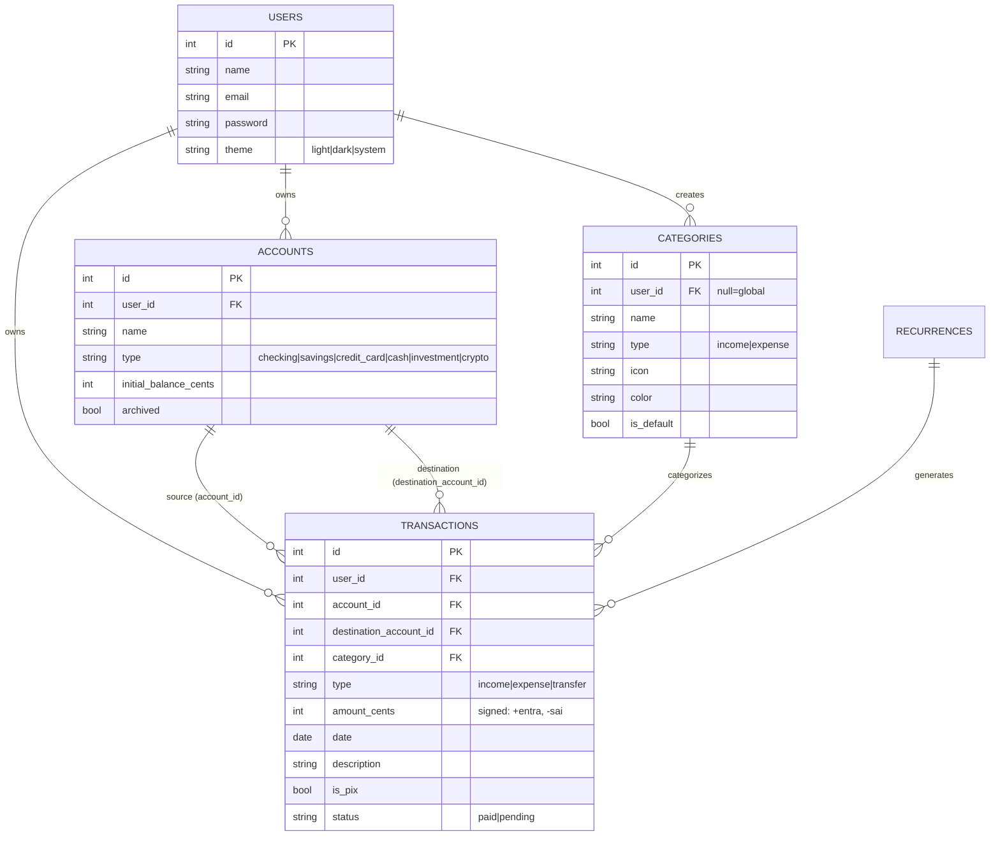

# ☀️ Solar

> Suas finanças pessoais, com luz própria.

**Solar** é um clone modernizado do **Microsoft Money Sunset (2008)**, construído em **Laravel 13 + Vue 3 + Inertia 3** com foco em UX contemporânea estilo fintech brasileira (Nubank/Inter/Will como referência).

## ✨ Status — FASE 1 (Foundation)

Recursos **funcionais** disponíveis:

- 🔐 **Auth completo** — registro, login, logout, middleware
- 🏠 **Dashboard** com 4 cards KPI (saldo total, receitas/despesas/economia do mês), lista de contas e transações recentes
- 💳 **CRUD de Contas** (corrente, poupança, cartão, dinheiro, investimento, cripto) com saldo calculado em tempo real
- 💸 **CRUD de Transações** (receitas, despesas, transferências) com filtros (busca, conta, categoria, tipo), paginação, flag PIX
- 🏷️ **15 Categorias** pré-populadas (Alimentação, Transporte, Moradia, Saúde, Educação, etc) com ícones emoji e cores
- 🌗 **Dark mode** com persistência em `localStorage` + tabela `users.theme`
- ⌨️ **Atalhos de teclado** (`n` = nova transação, `g d` = dashboard, `g t` = transações, etc)
- 📱 **Mobile-first** com bottom bar de navegação e FAB para nova transação
- 🧪 **13 testes automatizados** passando (auth, contas, transferências, soft delete)

Recursos a implementar nas próximas fases (veja `Roadmap` abaixo): gráficos, orçamento, recorrências, Open Finance, IA, etc.

## 🚀 Quick start

```bash
git clone https://github.com/hdellamanna/solar.git
cd solar

# Backend deps
composer install

# Frontend deps
npm install

# Banco SQLite + dados demo
touch database/database.sqlite
php artisan migrate:fresh --seed

# Subir
php artisan serve --host 0.0.0.0 --port 8000
npm run dev   # em outro terminal
```

Acesse `http://localhost:8000` e entre com:

- **Email:** `demo@solar.app`
- **Senha:** `solar123`

## 🧪 Testes

```bash
php artisan test
```

```
Tests:  13 passed (33 assertions)
Duration: <1s
```

## 🏗️ Stack

| Camada       | Tecnologia                              |
|--------------|------------------------------------------|
| Backend      | Laravel 13.8 · PHP 8.4 · SQLite (dev)   |
| Auth         | Sessions + CSRF (built-in, sem Breeze)   |
| Bridge       | Inertia.js 3.1 (sem API separada)        |
| Frontend     | Vue 3.5 · Composition API · TypeScript-friendly |
| Estado       | Pinia 3                                  |
| UI           | Tailwind 3.4 + tokens custom (solar)    |
| Bundler      | Vite 8 (rolldown)                        |
| Charts       | ApexCharts (próxima fase)                |
| Validação    | FormRequest (backend) + useForm (frontend) |

## 🗂️ Estrutura

```
app/
  Models/         # User, Account, Category, Transaction, Recurrence
  Http/
    Controllers/  # Auth/*, Account*, Transaction*, Dashboard*, Profile*
    Requests/     # FormRequests por recurso
    Middleware/   # HandleInertiaRequests (compartilha auth.user)
database/
  migrations/     # 8 migrations, soft deletes + índices
  seeders/        # 1 user demo, 5 contas, 15 categorias, ~140 transações
resources/js/
  Pages/
    Auth/         # Login, Register
    Accounts/     # Index, Create, Edit
    Transactions/ # Index, Form (criação e edição)
    Placeholders/ # Budgets, Reports
    Profile/      # Edit
  Layouts/        # AuthenticatedLayout (sidebar/bottombar), GuestLayout
  Composables/    # useTheme, useShortcuts, useFormat
  app.js          # createInertiaApp + Pinia + Ziggy
```

## 💰 Modelo de dados — diagrama ER



**Convenção monetária:** todos os valores são armazenados como `int` em centavos. Conversão para reais (divisão por 100) só acontece na camada de apresentação.

**Convenção de sinal:**
- `income` → `amount_cents > 0` (entra)
- `expense` → `amount_cents < 0` (sai)
- `transfer` → `amount_cents < 0` (sai da origem; destino recebe via `destinationTransactions`)

## 📐 UI/UX

- **Mobile-first**: testado em 375px (iPhone SE) até 1920px
- **Cores semânticas**: verde `income` (#16a34a), vermelho `expense` (#dc2626), amarelo `warn` (#ca8a04), azul `info` (#2563eb)
- **Moeda formatada** sempre em pt-BR: `R$ 1.234,56` via `Intl.NumberFormat`
- **Datas** em formato brasileiro: `26/06/2026`
- **Dark mode** com classe `dark` no `<html>`, persistido em `localStorage` e tabela `users.theme`
- **Bottom bar mobile** com 5 ícones + FAB central para nova transação

## 🛣️ Roadmap

| Fase | Status | Entrega |
|------|--------|---------|
| **FASE 1** | ✅ | Auth + Dashboard + CRUD contas/transações + seeders + testes |
| FASE 2 | 🔜 | Orçamentos com barra de progresso + recorrências + gráficos reais (ApexCharts) |
| FASE 3 | 🔜 | Importação CSV/OFX + Relatórios (pizza categoria, linha fluxo, export PDF/CSV) |
| FASE 4 | 🔜 | Metas de economia + Assinaturas rastreadas + PIX UI + busca global |
| FASE 5 | 🔜 | Investimentos + Dividas + IA categorize + PWA |
| FASE 6 | 🔜 | Multi-moeda + Modo casal + Open Finance (mock) + OCR (mock) |
| FASE 7 | 🔜 | Polish: onboarding, empty states, atalhos, testes E2E, deploy |

## 🤝 Contribuindo

PRs são bem-vindos. Antes de abrir:

```bash
composer install
npm install
php artisan test
```

## 📄 Licença

MIT — veja [LICENSE](LICENSE).
