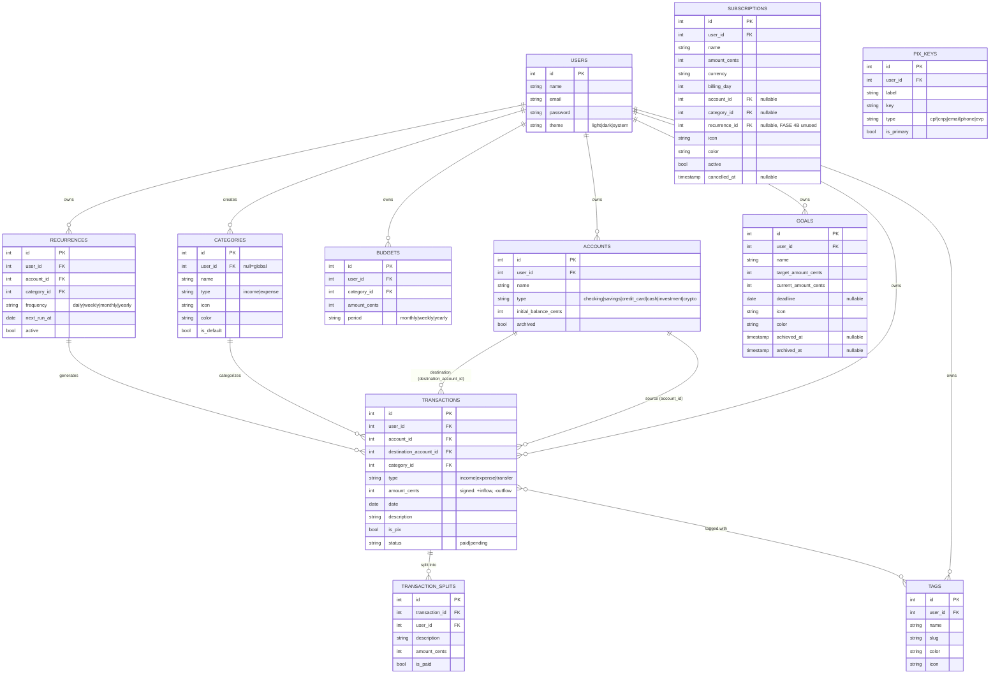

# ☀️ Solar

> Your personal finances, with their own light.

**Solar** is a modernized clone of **Microsoft Money Sunset (2008)**, built on **Laravel 13 + Vue 3 + Inertia 3** with a contemporary Brazilian fintech UX (Nubank / Inter / Will as references).

## ✨ Current status — FASE 4C delivered

Phases **1**, **2**, **3** and **4A / 4B / 4C** are complete and merged. Phases 5–10 are pending.

### FASE 1 — Foundation ✅
- 🔐 **Full auth** — registration, login, logout, middleware
- 🏠 **Dashboard** with 4 KPI cards (total balance, monthly inflow / outflow / savings), accounts list, recent transactions
- 💳 **Accounts CRUD** (checking, savings, credit card, cash, investment, crypto) with real-time computed balance
- 💸 **Transactions CRUD** (income, expense, transfer) with filters (search, account, category, type), pagination, PIX flag
- 🏷️ **15 pre-populated Categories** (Alimentação, Transporte, Moradia, Saúde, Educação, etc) with emoji icons and colors
- 🌗 **Dark mode** persisted in `localStorage` + `users.theme` table
- ⌨️ **Keyboard shortcuts** (`n` = new transaction, `g d` = dashboard, `g t` = transactions, etc)
- 📱 **Mobile-first** with bottom bar navigation and FAB for new transaction

### FASE 2 — Budgets + Recurrences + Reports ✅
- 🔄 **Recurrences** — auto-generate future transactions (weekly, monthly, yearly, custom)
- 💰 **Budgets** per category with progress bar and visual alert at 80% / 100%
- 📊 **Reports** with real charts (ApexCharts): category donut, 12-month flow line, daily spending, top merchants
- 🧪 `ReportService` centralizes calculations and caches for 5 min per user

### FASE 3 — Tags + Splits + Global search + Advanced filters ✅
- 🏷️ **Tags** colored and with emoji to organize transactions (8 demo tags: Trabalho, Pessoal, Urgente, Família, Viagem, Casa, Investimento, Imposto)
- ✂️ **Transaction splits** — divide an expense equally, by percentage, or by exact amount (great for roommates, couples, trips)
- 🔍 **Global search** (press `/`) across transactions, accounts, tags
- 🎯 **Advanced filters** on the transactions list: period (this month, last 3, custom), type, status (paid / pending), account, category, min / max amount
- 🔒 JSON API `/api/tags` and `/api/search` with session auth (not token)

### FASE 4A — Savings goals ✅
- 🎯 **Goals CRUD** with target amount, optional deadline, emoji icon, color
- 💸 **Contribute / withdraw** actions (in cents) keep a running `current_amount_cents`
- 🏆 **Auto-stamp** of `achieved_at` when current ≥ target
- 🛟 **Soft archive** keeps history without deleting
- 📊 **Dashboard widget** surfaces the top 3 in-progress goals (closest deadline first)
- 🧮 14 feature tests covering CRUD, contribute / withdraw, validation, isolation, achieved stamping, and progress cap at 100%

### FASE 4B — Tracked subscriptions ✅
- 📺 **Subscriptions CRUD** (Netflix, Spotify, iCloud, etc) with `billing_day`, amount, account, category, icon, color
- ⏸️ **Pause / reactivate** — paused subs are kept visible but excluded from monthly totals; cancelled subs are soft-archived
- 📅 **Auto-derived `next_billing_at`** from `billing_day` (rolls to next month when the day has already passed)
- 📊 **Dashboard widget** with monthly total + 3 closest to next billing
- 💸 Monthly and yearly projections per subscription
- 🧪 13 feature tests covering CRUD, pause / reactivate, billing-day roll-over, validation, isolation, dashboard widget

### FASE 4C — Dedicated PIX UI ✅
- 💸 **`/pix` screen** with monthly totals (received, sent, count), recent PIX transactions, saved keys, and most-used keys
- 🔑 **Saved PIX keys** (`pix_keys` table) with label, type (cpf / cnpj / email / phone / evp), primary flag
- 🧾 **Mock BR Code generator** — bottom-sheet on mobile, modal on desktop, builds a copy-pasteable string in the simplified EMV format (not scannable — the point is the UX, not real settlement)
- 🪪 **Key type auto-detection** (`usePix` composable: `classifyPixKey`, `maskPixKey`, `pixKeyTypeInfo`)
- 🎨 Apple-style bottom sheet with slide-up transition, auto-validating key, "Copiar" with `navigator.clipboard` + fallback
- 🧪 6 feature tests covering isolation, top-keys grouping, saved-keys, month totals

## 🚀 Quick start

```bash
git clone https://github.com/hdellamanna/solar.git
cd solar

# Backend deps
composer install

# Frontend deps
npm install

# SQLite database + demo data
touch database/database.sqlite
php artisan migrate:fresh --seed

# Run
php artisan serve --host 0.0.0.0 --port 8000
npm run dev   # in another terminal
```

Open `http://localhost:8000` and sign in with:

- **Email:** `demo@solar.app`
- **Password:** `solar123`

## 🧪 Tests

```bash
php artisan test
```

Current result:

```
Tests:  105 passed (498 assertions)
Duration: 1.36s
```

Coverage by feature:

- **Auth** — registration, login, logout, middleware
- **Accounts** — CRUD, balance, isolation, soft delete
- **Transactions** — income, expense, transfer, soft delete, splits, filters
- **Recurrences** — auto-generation, soft delete, inactive does not generate
- **Budgets** — calculation, reset, isolation by user
- **Reports** — 12 months, top categories, top merchants, isolation
- **Tags** — CRUD, auto slug, attach / detach, validation, isolation
- **Search** — global search by description, notes, amount, isolation
- **API auth** — `/api/*` uses session auth, not tokens
- **Goals (FASE 4A)** — CRUD, contribute / withdraw, achieved stamping, progress cap, isolation
- **Subscriptions (FASE 4B)** — CRUD, pause / reactivate, billing-day roll-over, validation, isolation, dashboard widget
- **PIX (FASE 4C)** — isolation, top-keys grouping, saved-keys, month totals

## 🏗️ Stack

| Layer        | Technology                                |
|--------------|-------------------------------------------|
| Backend      | Laravel 13.13 · PHP 8.4 · SQLite (dev)    |
| Auth         | Sessions + CSRF (built-in, no Breeze)     |
| Bridge       | Inertia.js 3.3 (no separate API)          |
| Frontend     | Vue 3.5 · Composition API                 |
| State        | Pinia 3                                   |
| UI           | Tailwind 3.4 + custom solar tokens        |
| Bundler      | Vite 8 (rolldown)                         |
| Charts       | ApexCharts 5.13 + vue3-apexcharts         |
| Validation   | FormRequest (backend) + useForm (frontend)|
| Tests        | PHPUnit 12 (Pest not yet supported on Laravel 13) |

## 🗂️ Structure

```
app/
  Models/         # User, Account, Category, Transaction, Recurrence, Budget, Tag, TransactionSplit, Goal
  Services/       # ReportService (monthlyFlow, categoryBreakdown, kpis, ...), RecurrenceService, TransactionFilterService, TransactionSplitService
  Http/
    Controllers/  # Account*, Auth/*, Budget*, Dashboard*, Goal*, Profile*, Recurrence*, Report*, Tag*, Transaction*
    Requests/     # FormRequests per resource (Store / Update)
    Middleware/   # HandleInertiaRequests (shares auth.user)
database/
  migrations/     # 19 migrations, soft deletes + indexes
  seeders/        # 1 demo user, 5 accounts, 15 categories, ~170 transactions, 8 tags, 3 goals, 4 subscriptions, 3 saved PIX keys
resources/js/
  Pages/
    Auth/         # Login, Register
    Accounts/     # Index, Create, Edit
    Transactions/ # Index, Form, Show
    Tags/         # Index (cards grid)
    Budgets/      # Index
    Recurrences/  # Index, Create, Edit
    Goals/        # Index, Create, Edit (FASE 4A)
    Subscriptions/# Index, Create, Edit (FASE 4B)
    Pix/          # Index (FASE 4C) — dedicated PIX UI with BR Code generator
    Reports/      # Index (ApexCharts: line, donut, bar, horizontal)
    Profile/      # Edit
  Layouts/        # AuthenticatedLayout (sidebar + bottom bar), GuestLayout
  Composables/    # useFormat, useShortcuts, useChart (useLineConfig / useDonutConfig / useBarConfig), useTag, useTransactionFilters, useGlobalSearch, usePix (FASE 4C)
  app.js          # createInertiaApp + Pinia + Ziggy + ApexCharts global
```

## 💰 Data model — ER diagram



**Money convention:** all amounts are stored as `int` cents. Conversion to BRL (division by 100) only happens in the presentation layer.

**Sign convention:**

- `income` → `amount_cents > 0` (inflow)
- `expense` → `amount_cents < 0` (outflow)
- `transfer` → `amount_cents < 0` (outflow from source; destination receives via `destinationTransactions`)

## 📐 UI/UX

- **Mobile-first** — tested from 375px (iPhone SE) up to 1920px
- **Semantic colors** — green `income` (#16a34a), red `expense` (#dc2626), yellow `warn` (#ca8a04), blue `info` (#2563eb)
- **Currency** formatted in pt-BR: `R$ 1.234,56` via `Intl.NumberFormat`
- **Dates** in Brazilian format: `26/06/2026`
- **Dark mode** with `dark` class on `<html>`, persisted in `localStorage` and `users.theme`
- **Mobile bottom bar** with 5 icons + central FAB for new transaction
- **Keyboard shortcuts** — `n` (new tx), `g d` (dashboard), `g t` (transactions), `g a` (accounts), `/` (global search), `Esc` (close modals)

## 🛣️ Roadmap

| Phase | Status  | Deliverable                                                                              |
|-------|---------|------------------------------------------------------------------------------------------|
| 1     | ✅ done | Auth + Dashboard + Accounts / Transactions CRUD + seeders + tests                       |
| 2     | ✅ done | Recurrences + Budgets + Reports (ApexCharts)                                            |
| 3     | ✅ done | Tags + Splits + Global search + Advanced filters                                        |
| 4A    | ✅ done | Savings goals with dashboard widget                                                     |
| 4B    | ⏳ next | Tracked subscriptions (Netflix, Spotify, etc)                                           |
| 4C    | ⏳ next | Dedicated PIX UI (history, copy / paste, mock BR Code)                                  |
| 5     | ⏳ todo | Investments + Debts + AI categorize + PWA                                               |
| 6     | ⏳ todo | Multi-currency + Couples mode + OFX / CSV import + OCR                                   |
| 7     | ⏳ todo | Tri-lingual i18n (pt-BR, es, en) with 3 names per category / tag                         |
| 8     | ⏳ todo | AI financial advisor (rule-based MVP + optional Groq integration)                        |
| 9     | ⏳ todo | Crypto tracker (live price via CoinGecko, P&L)                                           |
| 10    | ⏳ todo | Polish + E2E tests (Playwright) + Deploy                                                |

## 🤝 Contributing

PRs are welcome. Before opening one:

```bash
composer install
npm install
php artisan test
```

Project conventions:

- **Code in English** (names, comments, commit messages); user-facing UI strings stay in pt-BR (product default) and are designed to be replaced via i18n in phase 7
- **PHPDoc** on every public method of services and controllers
- **Soft deletes** on any table that holds user-generated data
- **Conventional commits** (`feat:`, `fix:`, `chore:`, `docs:`)
- **Branches** named `feat/fase-N-feature`, PR against `main`
- **Don't merge your own PR** — wait for review

## 📄 License

MIT — see [LICENSE](LICENSE).
